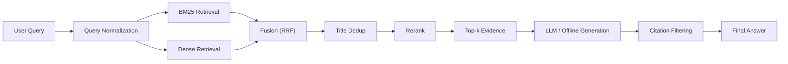

# Perplexity Lite

[English](./README.md) | [简体中文](./README.zh-CN.md)

> A Perplexity-style search QA system with hybrid retrieval, reranking, and citation-grounded generation.

Supports explainable answers, path tracing, and quantitative evaluation across retrieval quality, grounding quality, and latency.

## Project Positioning

This is a beginner-oriented learning project built to practice a modern retrieval and grounded-generation stack end to end.

It should be read as a hands-on systems exercise rather than a polished production product. The goal was to learn by implementing and connecting core components such as:

- corpus preparation
- offline indexing
- sparse and dense retrieval
- fusion and reranking
- citation-grounded generation
- evaluation, tracing, and reporting

## Why This Project Exists

This project is not a generic chatbot demo. It is a production-style search QA prototype built to answer factual questions with explicit evidence, measurable behavior, and observable execution paths.

It focuses on five practical problems in real RAG systems:

- retrieval noise
- weak multi-entity coverage
- missing rerank control
- ungrounded answers
- poor observability and evaluation

The system addresses them with:

- hybrid retrieval with `BM25 + dense + title-fast`
- reciprocal rank fusion and title-level dedup
- reranking before generation
- citation-grounded answering
- request trace metadata and offline evaluation reports

## System Story

The main pipeline is a two-stage retrieval and reranking system with grounded generation.



For a narrow set of high-precision entity questions, the system can take a `fast_path` instead of paying the full slow-path retrieval cost. That fast path is treated as an optimization layer, not the main reasoning engine.

## What Makes It Different From A Demo

- It persists offline-built retrieval indexes under `artifacts/indexes/` instead of rebuilding at every run.
- It returns `timings` and `trace` in API/UI responses, not just an answer string.
- It evaluates retrieval, grounding, fast-path behavior, and latency with a unified report.
- It separates retriever, reranker, generator, and orchestration layers so the system stays inspectable and replaceable.

## End-to-End Example

Representative query:

> Were Scott Derrickson and Ed Wood of the same nationality?

### Step 1. Retrieval

The pipeline retrieves a broader candidate set than the final `top_k`, combining sparse and dense signals. The goal is high recall before quality control.

### Step 2. Fusion And Dedup

BM25 and dense candidates are merged with reciprocal rank fusion, then deduplicated at the title level so repeated chunks do not crowd out multi-entity coverage.

### Step 3. Rerank

The reranker reduces semantic drift and keeps evidence for both entities near the top. In the regression suite, this case resolves to:

- `Scott Derrickson`
- `Ed Wood`

### Step 4. Generation

The answer is produced from reranked evidence only:

```text
Both Scott Derrickson and Ed Wood are American, so they share the same nationality. [1][2]
```

### Step 5. Citation Filtering

Only citations actually used in the answer are returned. For this case, the final cited titles are:

- `Scott Derrickson`
- `Ed Wood`

This keeps the output closer to search-style evidence presentation than generic RAG dumping.

## Traceability

Each response includes machine-readable execution metadata so the system can explain how it answered, not just what it answered.

Example trace shape:

```json
{
  "request_id": "2d6c2b5c1e6d4a7f9d2c6f3b5e2a1c44",
  "query": "Were Scott Derrickson and Ed Wood of the same nationality?",
  "selected_path": "fast_path",
  "path_reason": "fast_path_match",
  "retrieved_candidate_count": 6,
  "reranked_candidate_count": 2,
  "generator_mode": "fast_path",
  "cache_hit": 0
}
```

The API and Streamlit UI also expose per-stage timing fields:

- `retrieval_seconds`
- `rerank_seconds`
- `generation_seconds`
- `total_seconds`

## Current Metrics

Latest unified report: `artifacts/reports/latest_report.md`

The current checked-in report was generated on `2026-03-22` with:

- evaluation split: `HotpotQA dev_distractor`
- eval limit: `5`
- regression cases: `7`

### Retrieval And Grounding

| Metric | Value |
| --- | ---: |
| Recall@5 | 1.0000 |
| Recall@10 | 1.0000 |
| MRR | 0.7333 |
| Citation Hit Rate | 1.0000 |
| Citation Precision | 0.7000 |
| Answer Grounded Rate | 1.0000 |

### Regression And Latency

| Metric | Value |
| --- | ---: |
| Regression Pass Rate | 1.0000 |
| Fast-Path Hit Rate | 0.5714 |
| Average Total Latency | 0.0218s |
| Fast-Path Avg Latency | 0.0002s |
| Slow-Path Avg Latency | 0.0505s |
| Slow/Fast Speedup | 224.30x |

These numbers come directly from `artifacts/reports/latest_report.json` and should be interpreted as a small checked-in snapshot, not a final benchmark claim.

## Fast Path

The fast path exists for simple, structured, entity-centric questions such as:

- nationality
- profession
- birthplace
- two-entity comparison for nationality, profession, birthplace, or age

Current measured behavior from the checked-in report:

- `fast_path_hit_rate = 0.5714`
- `speedup_ratio = 224.30x`

Design rule:

> Fast path is an optimization layer, not the primary reasoning path.

When fast path does not apply, the system falls back to the normal grounded QA path.

## Offline Mode Validation

The repository is designed to remain runnable even without external LLM access.

Current offline behavior:

- if `LLM_PROVIDER` is unset, the system stays in offline mode
- if `LLM_API_KEY` is missing, the system stays in offline mode
- slow-path generation still returns citation-grounded answers through the local fallback generator

The checked-in regression and report artifacts already include offline cases:

- `slow_experiment` for `What did the Pound–Rebka experiment test?`
- `slow_purpose` for `What is the purpose of the Nucifer experiment?`
- `guardrail_birth_city` for `What city was Christopher Nolan born in?`

From `artifacts/reports/latest_report.json`, these offline cases currently show:

- offline case count: `3`
- offline regression pass rate within the checked-in set: `1.0000`
- offline mean latency in the checked-in report: `0.0005s`

This should be read as a small repository snapshot proving that the system does not depend on hosted generation to function end to end.

## Knowledge Boundary And Application Outlook

This system is corpus-grounded rather than open-world.

That means it is designed to answer from the indexed corpus, not from unconstrained external knowledge. In practice:

- if the required evidence exists in the indexed corpus, the system can retrieve, rerank, and answer with citations
- if the question is new but the evidence is still in the corpus, the system can usually generalize through retrieval
- if the required evidence is outside the corpus, the system should expose that boundary instead of pretending to know

This is a useful product property, not just a limitation.

In internal company settings, the same boundary can be used to keep the assistant scoped to approved knowledge sources such as:

- internal documentation
- wikis
- policy manuals
- technical runbooks
- private reports

Potential benefits in that setting:

- narrower knowledge scope reduces accidental leakage from unrelated sources
- answers can be constrained to approved internal documents
- citation grounding improves auditability and trust
- teams can control freshness by rebuilding indexes from curated corpora
- offline or private-deployment modes are easier to reason about than fully open-world assistants

So the long-term application story is not only "better RAG quality", but also "safer bounded retrieval over controlled knowledge."

## Industry Use Cases

This architecture is especially relevant for knowledge-dense industries such as insurance and finance, where employees work across large volumes of policies, historical files, internal procedures, product documents, and compliance materials.

An internal deployment could index sources such as:

- policy wording and underwriting rules
- claims manuals and historical case summaries
- risk-control guidelines and internal audit notes
- investment research reports and product memos
- compliance procedures, SOPs, and internal wiki content

With that setup, the system can function as a bounded internal knowledge assistant that helps teams:

- ask natural-language questions over approved internal documents
- retrieve supporting evidence instead of returning unsupported summaries
- surface relevant historical cases or prior internal interpretations
- reduce time spent searching across PDFs, wikis, attachments, and fragmented systems
- preserve traceability through citations and request-level execution traces

Example workflow outcomes:

- a claims reviewer finds the most relevant historical handling basis for a similar case
- an operations teammate checks which supporting materials are required under a specific policy rule
- a compliance analyst locates the internal document version behind a business rule
- a research or product team member retrieves prior internal views on a company, sector, or product design

Practical value in these environments:

- faster information lookup
- lower dependency on manual tribal knowledge
- better consistency across teams answering similar questions
- easier onboarding for new employees
- improved auditability for high-stakes internal decisions

This does not replace expert judgment. It shortens the path from question to evidence, which is often the real bottleneck in day-to-day knowledge work.

## Repository Layout

```text
src/
  api/          FastAPI entrypoint
  core/         config, runtime, schemas, telemetry
  data/         HotpotQA loading, chunking, export
  evaluation/   retrieval, grounding, regression, benchmark, report
  generation/   grounded generation and OpenAI-compatible client
  indexing/     offline index builders
  pipeline/     end-to-end orchestration
  rerank/       reranker abstraction and hosted reranker
  retrieval/    BM25, dense, hybrid, fusion, dedup, title-fast
app/
  streamlit_app.py
docs/
  architecture and review notes
artifacts/
  raw data, chunks, indexes, reports
```

## Quick Start

### 1. Install Dependencies

```bash
pip install -r requirements.txt
```

### 2. Configure Optional LLM Access

The project runs in offline mode by default.

For security, this repository should only contain placeholder configuration values. Do not commit real API keys, tokens, or private endpoint credentials.

To use an OpenAI-compatible endpoint locally, copy `.env.example` to `.env` and fill in your own values:

```bash
cp .env.example .env
```

Then update `.env` with your local credentials:

```bash
LLM_PROVIDER=openai_compatible
LLM_API_KEY=your_api_key
LLM_MODEL=deepseek-chat
LLM_BASE_URL=https://api.deepseek.com
```

Useful runtime settings:

```bash
DENSE_ENCODER_BACKEND=transformer
DENSE_MODEL_NAME=sentence-transformers/all-MiniLM-L6-v2
PRELOAD_RETRIEVERS=true
PREWARM_QUERY_ENCODER=true
SEMANTIC_REFINER_ENABLED=false
```

If `LLM_PROVIDER` is unset or `LLM_API_KEY` is missing, the generator stays in offline mode.

Recommended public-repo practice:

- keep `.env` local only
- commit `.env.example` with placeholders only
- rotate or revoke any key that was ever exposed during development

### 3. Build Chunks If Needed

```bash
python3 -m src.data.indexing \
  --source artifacts/raw/hotpotqa/hotpot_train_v1.1.json \
  --output artifacts/chunks/train_chunks.jsonl
```

### 4. Build Retrieval Indexes

Hash baseline:

```bash
python3 -m src.indexing.build_index \
  --source artifacts/raw/hotpotqa/hotpot_train_v1.1.json \
  --chunks artifacts/chunks/train_chunks.jsonl \
  --index-dir artifacts/indexes \
  --vector-dim 128
```

Transformer-backed FAISS index:

```bash
python3 -m src.indexing.build_index \
  --source artifacts/raw/hotpotqa/hotpot_train_v1.1.json \
  --chunks artifacts/chunks/train_chunks.jsonl \
  --index-dir artifacts/indexes \
  --encoder-backend transformer \
  --model-name sentence-transformers/all-MiniLM-L6-v2 \
  --encode-batch-size 64
```

### 5. Run The API

```bash
uvicorn src.api.main:app --reload
```

Endpoints:

- `GET /health`
- `POST /search`

### 6. Run The UI

```bash
streamlit run app/streamlit_app.py
```

## Reproducibility Notes

This public repository is intentionally kept lightweight.

It does not include full raw datasets, built chunk corpora, or retrieval indexes in version control. That is a deliberate tradeoff for:

- repository size control
- cleaner public sharing on GitHub
- avoiding redistribution of large or potentially restricted assets
- encouraging local rebuilds from source data instead of committing machine-specific artifacts

At the time of writing, the excluded local artifacts are approximately:

- `artifacts/raw/`: `1.1G`
- `artifacts/chunks/`: `842M`
- `artifacts/indexes/`: `7.1G`

What is kept in the repo:

- source code under `src/` and `app/`
- documentation under `docs/`
- dependency and config templates such as `requirements.txt` and `.env.example`
- lightweight evaluation outputs under `artifacts/reports/`

### Minimal Repro

For a quick local check, you can:

1. install dependencies
2. keep the system in offline mode
3. review the checked-in report artifacts
4. point the project to your own small local sample corpus, or rebuild from the documented dataset path if available

This is the fastest way to understand the architecture and verify the runtime wiring.

### Full Repro

To reproduce the full pipeline locally:

1. acquire the source dataset separately
2. place it under the expected `artifacts/raw/...` path, or override the paths in `.env`
3. export chunks with `python3 -m src.data.indexing`
4. build retrieval indexes with `python3 -m src.indexing.build_index`
5. run evaluation and reporting with the `src.evaluation.*` commands documented below

In other words, this repository preserves the pipeline and the rebuild instructions, while excluding heavyweight generated assets from source control.

## Evaluation

Run retrieval and grounding evaluation:

```bash
python3 -m src.evaluation.evaluate --limit 20
```

Run the fixed regression suite:

```bash
python3 -m src.evaluation.regression --debug
```

Run latency benchmarking:

```bash
python3 -m src.evaluation.benchmark --warmup --rounds 3
```

Generate the unified report:

```bash
python3 -m src.evaluation.report --eval-limit 20 --benchmark-rounds 1
```

Report outputs:

- `artifacts/reports/latest_report.json`
- `artifacts/reports/latest_report.md`

## Example API Response

```json
{
  "request_id": "8f6d9f4d8a9c4f54b9467f4e8f298e6c",
  "answer": "Both Scott Derrickson and Ed Wood are American, so they share the same nationality. [1][2]",
  "generator_mode": "fast_path",
  "timings": {
    "retrieval_seconds": 0.0,
    "rerank_seconds": 0.0002,
    "generation_seconds": 0.0002,
    "total_seconds": 0.0004
  },
  "trace": {
    "selected_path": "fast_path",
    "path_reason": "fast_path_match",
    "retrieved_candidate_count": 6,
    "reranked_candidate_count": 2,
    "generator_mode": "fast_path",
    "cache_hit": 0
  }
}
```

## Limitations

- The checked-in report is intentionally small and should be treated as a sanity snapshot, not a large-scale benchmark.
- Citation precision is title-overlap based and still approximates groundedness.
- Fast path is intentionally narrow; open-ended conceptual questions still rely on the slower grounded pipeline.
- Hosted rerank and hosted generation quality depend on external provider configuration when enabled.

## Useful Docs

- `docs/system-architecture.md`
- `docs/fast-path-boundary.md`
- `docs/ops-note.md`
- `docs/project-review-brief.md`
- `artifacts/reports/latest_report.md`

## One-Line Summary

This project upgrades a runnable RAG demo into a more serious search QA system that is measurable, explainable, and operationally inspectable.
