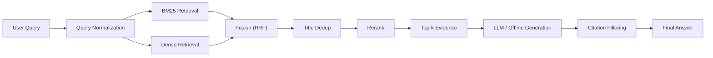

# Perplexity Lite

[English](./README.md) | [简体中文](./README.zh-CN.md)

> 一个带有混合检索、重排序和 citation-grounded generation 的 Perplexity 风格搜索问答系统。

支持可解释回答、路径追踪，以及对检索质量、grounding 质量和延迟的量化评估。

## 项目定位

这是一个偏新手练习性质的学习项目，目标是把现代检索增强问答系统里的关键技术栈亲手串起来。

它更适合被理解为一个完整的工程化学习实践，而不是已经完全产品化的系统。这个项目主要用于学习和练习以下能力：

- 语料准备与切分
- 离线索引构建
- 稀疏检索与稠密检索
- 融合、去重与重排序
- 基于证据的回答生成
- 评估、traceability 与报告输出

## 项目简介

这个项目不是一个泛化聊天机器人 demo，而是一个更偏 search QA 的原型系统。它希望回答事实类问题时，不只返回答案，还尽量返回：

- 检索证据
- 引用来源
- 路径信息
- 可量化的评估结果

系统当前主要关注这些真实问题：

- 检索噪声大
- 多实体问题覆盖不足
- 缺少 rerank 控制
- 回答不够 grounded
- 缺少可观察性和评估闭环

## 系统流程

主路径是一个两阶段检索加 grounded generation 的流程：



对于少量高精度、结构明确的实体类问题，系统也支持 `fast_path`，用于降低延迟。但它被定义为优化层，不是主推理路径。

## 当前特性

- 使用 `BM25 + dense + title-fast` 做混合检索
- 使用 reciprocal rank fusion 做结果融合
- 在 rerank 前做 title-level dedup
- 回答时只保留真正被答案使用到的 citation
- API / Streamlit 返回 `timings` 和 `trace`
- 支持统一评估报告
- 在没有外部 LLM 的情况下可退化到 offline mode

## 当前评估快照

当前仓库内保留了轻量级评估报告：

- `artifacts/reports/latest_report.json`
- `artifacts/reports/latest_report.md`

当前 checked-in 报告中的部分指标：

| 指标 | 数值 |
| --- | ---: |
| Recall@5 | 1.0000 |
| Recall@10 | 1.0000 |
| MRR | 0.7333 |
| Citation Hit Rate | 1.0000 |
| Citation Precision | 0.7000 |
| Answer Grounded Rate | 1.0000 |
| Regression Pass Rate | 1.0000 |
| Fast-Path Hit Rate | 0.5714 |
| Slow/Fast Speedup | 224.30x |

这些指标来自当前仓库中的小规模评估快照，适合展示系统行为，但不应被理解为最终大规模 benchmark。

## 知识边界

这个系统是 `corpus-grounded` 的，而不是 open-world assistant。

也就是说：

- 如果答案所需证据存在于索引语料中，系统有机会检索、重排并给出带引用的回答
- 如果问题换了表达方式，但相关证据仍然在语料中，系统通常也可以通过检索泛化
- 如果证据根本不在语料里，系统理论上应该暴露边界，而不是假装知道

这个特性对于企业内部场景反而是优势，因为它可以把回答严格限制在受控语料上。

## 行业应用场景

这套架构很适合保险、金融等知识密集型行业。因为这些行业内部通常有大量：

- 制度文件
- 产品说明
- 历史案例
- 合规材料
- 研究报告
- 流程文档和内部 wiki

如果把这些材料整理成内部知识语料并建立索引，这个系统可以演化成一个有边界、可追踪的内部知识助手，用来：

- 用自然语言查询内部资料
- 返回证据而不是只返回结论
- 复用历史案例和已有解释口径
- 缩短在 PDF、附件、wiki、邮件之间反复查找的时间
- 提高审计性和可追溯性

它不替代专业判断，但能显著缩短“从问题到证据”的路径。

## 离线模式

这个仓库设计成即使没有外部 LLM 也能运行。

当以下条件成立时，系统会停留在 offline mode：

- `LLM_PROVIDER` 未设置
- `LLM_API_KEY` 缺失

在这种情况下，系统仍然可以走检索、重排、离线 fallback 生成和 citation 输出流程。

## 快速开始

### 1. 安装依赖

```bash
pip install -r requirements.txt
```

### 2. 配置可选的 LLM 访问

仓库中只应保留占位符配置，不应提交真实密钥。

先复制：

```bash
cp .env.example .env
```

再在本地 `.env` 中填写你自己的配置，例如：

```bash
LLM_PROVIDER=openai_compatible
LLM_API_KEY=your_api_key
LLM_MODEL=deepseek-chat
LLM_BASE_URL=https://api.deepseek.com
```

如果没有配置这些内容，系统会保持 offline mode。

### 3. 运行 UI

```bash
streamlit run app/streamlit_app.py
```

### 4. 运行 API

```bash
uvicorn src.api.main:app --reload
```

### 5. 运行评估

```bash
python3 -m src.evaluation.evaluate --limit 20
python3 -m src.evaluation.regression --debug
python3 -m src.evaluation.benchmark --warmup --rounds 3
python3 -m src.evaluation.report --eval-limit 20 --benchmark-rounds 1
```

## 公开仓库复现说明

为了控制仓库体积并避免上传大型或受限制资产，当前公开仓库不会包含这些内容：

- 完整原始数据集
- 已生成的 chunks
- 检索索引文件

仓库中保留的是：

- 代码
- 文档
- 配置模板
- 轻量级报告产物

也就是说，这个公开仓库保留的是“完整方法和重建路径”，而不是“所有本地大文件”。

如果想完整复现：

1. 自行准备源数据集
2. 放到 `artifacts/raw/...` 或在 `.env` 中覆盖路径
3. 运行 `src.data.indexing`
4. 运行 `src.indexing.build_index`
5. 运行评估与报告脚本

## 仓库结构

```text
src/
  api/          FastAPI 入口
  core/         config, runtime, schemas, telemetry
  data/         数据加载、切分、导出
  evaluation/   评估、回归、benchmark、report
  generation/   grounded generation 与 OpenAI-compatible client
  indexing/     离线索引构建
  pipeline/     端到端编排
  rerank/       reranker 抽象与实现
  retrieval/    BM25、dense、hybrid、fusion、dedup、title-fast
app/
  streamlit_app.py
docs/
  架构、评估与规划说明
artifacts/
  轻量级报告产物
```

## 一句话总结

这个项目的目标，是把一个可运行的 RAG demo，逐步推进成一个更可评估、可解释、可观察的搜索问答系统原型，同时在过程中练习完整的相关技术栈。
